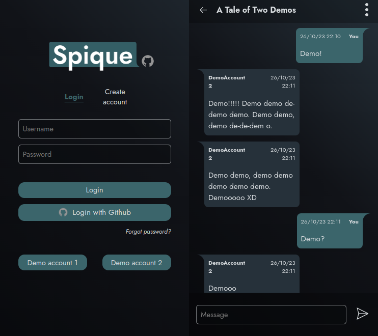

# Spique

Backend API: [Repo](https://github.com/MaoShizhong/Spique-backend)

---

## Front end made with

-   ReactJS/Vite
-   React Router
-   Accessibility - fully navigable via keyboard, including comprehensive screen-reader support
-   Login/account creation manually or via Github
-   Password resets via email (using one-time unique secure links)
-   Account deletion via email (using one-time unique secure links)

## Plans

-   Websockets for real time updates for messages/channel updates/friend requests
-   Upload and send locally stored images
-   Display and play embedded video links
-   Allow editing/deleting messages
-   Profile avatars
-   E2E encryption
